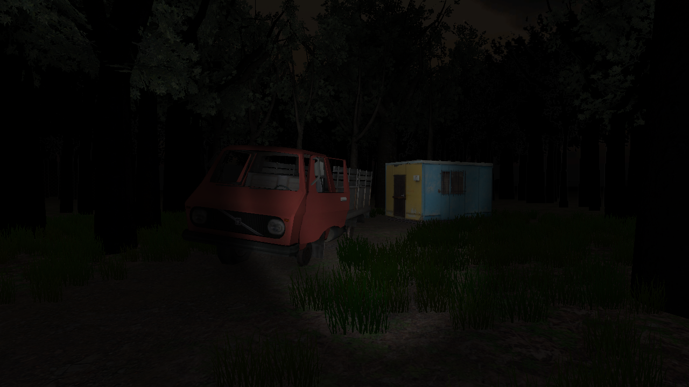
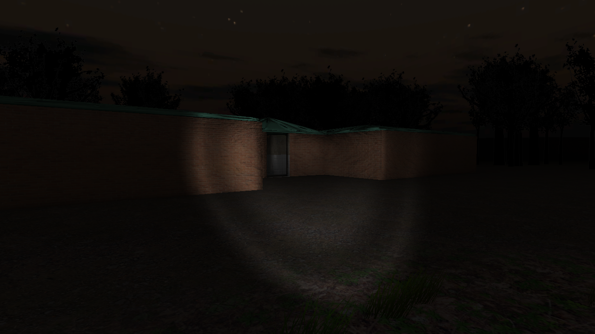
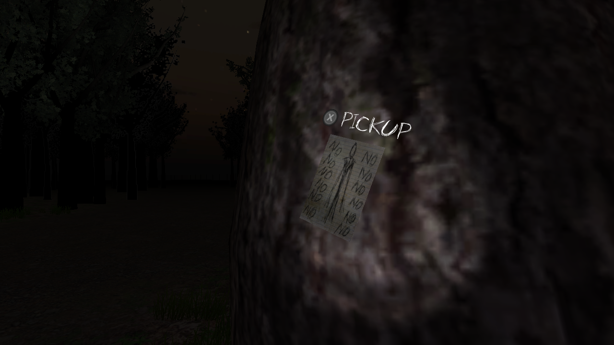
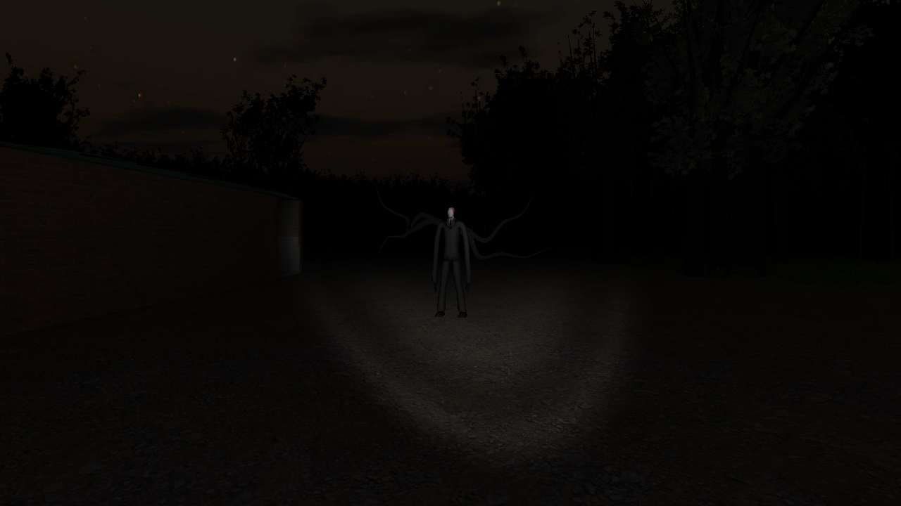

# Slender The Eight Pages: Wii U Edition

**A homebrew port of Slender The Eight Pages for the Wii U.**  
## About
STEP: Wii U Edition is a fan-made homebrew port of *Slender The Eight Pages*, adapted and recoded for the Wii U. This project aims to faithfully recreate the experience of the original game while optimizing it for Nintendo's console.

- Website : https://sourcemacchiato.com/
- Source Macchiato Discord : https://sourcemacchiato.com/discord 

## Features
- Achievements system using [BrewConnect API](https://www.brew-connect.com/)
- Collected pages displayed on the GamePad
- More soon...

### Controllers supported :
- GamePad
- Pro
- Classic
- Classic Pro

## Installation
### Requirements
- A homebrewed Wii U (Haxchi, Mocha, Tiramisu or Aroma)
- NUSspli or WUP Installer GX2
- SD card with sufficient space

### How to install
1. Download the latest release from the [itch.io official page](https://source-macchiato.itch.io/step-wiiu-edition).
2. Put the unzipped folder in the "install" folder of your SD card
3. Start the installation with WUP Installer GX2 or NUSspli (don't forget to put the [Sigpatches module](https://github.com/marco-calautti/SigpatchesModuleWiiU) in SD:/wiiu/environments/your-environment/modules/setup).
4. Go back to the Wii U menu, the game should appear. if you have any issue [join our discord server](https://sourcemacchiato.com/discord)

## Controls
| Action                  | Controls                          |
|-------------------------|----------------------------------|
| Move         | Left stick       |
| Look          | Right stick                                |
| Pickup         | X                  |
| Flashlight     | Y   |
| sprint             | ZL, L (Classic)                            |

## Images of the game
   
## Contributing
If you’d like to contribute to this project, feel free to submit pull requests. Any bug reports or feature suggestions are welcome in the [Issues](https://github.com/Source-Macchiato/SlenderEightPages-WiiU-SC/issues) section.

## Special Thanks
Thanks to [@Real_JackOfficial_Demon](https://gamejolt.com/@Real_JackOfficial_Demon) for their decompilation work!
